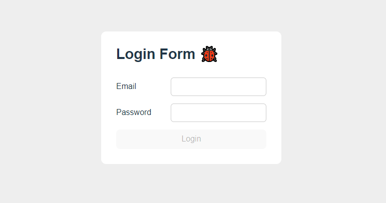

<h1 align="center"> React Interview Challenge #02  </h1>

### Instructions:
- You have a uncompleted form. It's not valid add new HTML elements neither use UseRef hook.

### Tasks:
- The login button should call login() function imported inside de "App.jsx" file and pass all necessary data;
- Disable the login button with the email is blank or if the password is less the 6 digits;
- There'll have a daley when you clicks the login button simulating the database search. You must disable the login button while this happens;
- Show an error message if the login fails. The message should be clean after every new login attempt;
- Show an alert message if the login succeed. 

 

**PS:** The success login is with the password **_"password123"_**. The email can be any.

## Challenge Resolution - Fernandev (PT-BT)

https://youtu.be/NAtf3T9gG7s
